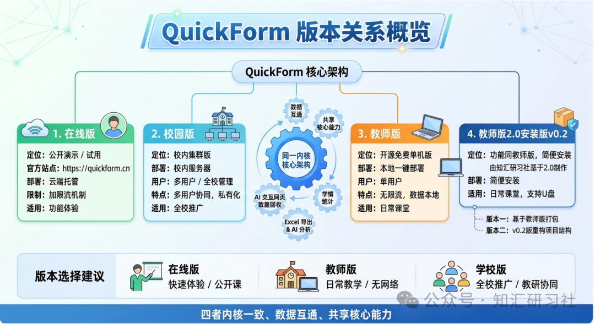

# 版本说明与更新记录

QuickForm的每一次版本升级，都来自我们对人工智能赋能教育的理解，来自我们对一线教师需求的回应。

## 版本说明

QuickForm分为教师版、校园版和在线版等三个版本，基本功能一致，都可以无限制收集表单数据，核心区别在于教师版为单用户，校园版支持多用户，而在线版为校园版的演示网站。

### 在线版

在线版即为QuickForm校园版的演示网站。因为考虑到要为很多教师服务，所以做了一些关于并发流量方面的限制，同时增加了社区交流功能。在线版仅仅用于学习、调试，不宜作为真正教学。因为同时访问的用户一多，可能会导致数据存取的工作不正常。

需要强调的是，在线版使用了ssl（https）协议，Deepseek、豆包、扣子编程之类的大模型能直接访问，调试功能比较容易。我们建议老师们用在线版调试数据任务，再导出到其他版本，如校园版和教师版。

QuickForm在线版地址：[https://quickform.cn](https://quickform.cn)

### 校园版

顾名思义，QuickForm校园版可以安装在学校服务器上，供全校教师一起使用。QuickForm校园版对服务器操作系统没有特别要求，性能稍好一点的电脑，安装了Python环境和PostgreSQL（数据库）即可。服务器具体配置需求与用户数量和访问频率有关。

我们为QuickForm校园版做了优化，管理员可以导入用户，通过Web页面即可管理各种信息，如是否支持注册，是否需要认证等。

特点：多用户，免费软件，定向开源。目前，校园版仅仅面向项目合作校（单位）开源。

如果有意向加入项目合作，请先阅读协议，再联系方建文或者谢作如。联系方式如下：
  - 方建文：beginnerfjw@163.com
  - 谢作如：8334180@qq.com

协议链接：https://mp.weixin.qq.com/s/JIJSxCsL-ImGNuS2UnoAZg

### 教师版

QuickForm教师版为开源软件，支持任何能运行Python的操作系统，对电脑配置要求很低，适合安装在教师的个人电脑上，包括笔记本电脑。

特点：单用户，开源软件，可后期开发。通过开源仓库，直接下载使用即可。

QuickForm教师版的具体功能变化以github和gitee上为准。

  - GitHub地址：[https://github.com/wstlab/quickform](https://github.com/wstlab/quickform）
  - Gitee地址：[https://gitee.com/wstlab/quickform](https://gitee.com/wstlab/quickform）

### 如何选择版本

如果你仅仅为了试用一下QuickForm，那么直接使用我们已经部署好的QuickForm在线版（QuickForm.cn）就好了，地址为：[https://quickform.cn](https://quickform.cn)。

如果你执教的某节公开课需要体现“AI赋能”“精准教学”这些亮点，期望能稳定运行，建议在本地部署QuickForm校园版或者教师版。因为QuickForm在线版访问人数多，很难确保稳定可用。

如果你想要在日常课堂教学中都能使用QuickForm，建议在自己的电脑上部署QuickForm教师版。下载QuickForm教师版，解压后就可以使用。这样可以确保网络访问稳定，以及数据的安全。

如果你希望学生在家里也能使用，即课外也能使用。那么你可以使用借助外网穿透技术，将自己的电脑Web服务映射到外网。当然，你也可以购买某个云服务器（如阿里云、腾讯云等），部署教师版，拥有自己的专用QuickForm服务。

如果你是学校的领导（数字化建设方面），希望全校老师都能使用QuickForm，以此为抓手提高老师们的AI赋能教学能力，那么请联系我们。加入项目组后，部署QuickForm校园版供全校师生服务。

不管你出于某种需求，我们都强烈建议你先注册[https://quickform.cn](https://quickform.cn)，先用最快，最简洁的方式用一次QuickForm，熟悉操作后，再做后续的选择。

感谢陈亮老师整理的QuickForm版本对比图

## 更新记录

2026.5，发布教师版2.5，支持多语言版本，支持文件数据的回收。

2026.5，发布教师版2.0，校园版1.0，推出“QF数据互联”功能，实现在线版、校园版和教师版的数据任务同步。

2026.5.1，QuickForm注册单位（学校）超过一万。

2026.4.29，QuickForm项目组在全国中小学人工智能赋能教育与人工智能通识教育研讨会上发布第一批合作单位（校）名单。

2026.4.17，QuickForm注册教师超过一万。

2026.4.14，浙江都市快报记者采访谢作如，以《没写一行代码，却设计出一款教育届“小龙虾”，这位高中老师希望让乡村教师也能玩转AI教学》为主题刊发。因为流量过大，在线版启用“限流”功能。

2026.3.27，温州都市报记者采访了QuickForm团队，以《温州老师“手搓”一款教学神器，全国教师抢着用！项目面临成长的“烦恼”》进行报道。QuickForm项目网站上线：[地址：https://quickform.cc](https://quickform.cc)。

2026.3，QuickForm分化为在线版、校园版和教师版，教师版1.5发布。

2026.2.8，QuickForm校园版升级上线，启用新域名：[地址：https://quickform.cn](https://quickform.cn)，校园版开始征集合作单位。

2026.1，QuickForm教师版1.2发布，内置Python环境，实现一键启动。

2025.12.27，QuickForm项目在第二届中小学人工智能与创客教育大会上正式发布，并举办公益工作坊。

2025.12，QuickForm分化为教师版和校园版，教师版1.0开源。

2025.11.1，使用Trae编写了QuickForm Demo版本，一周后在公网部署。
