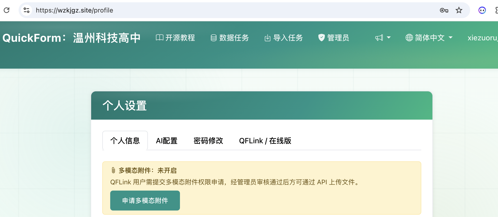

# 多模态任务：图片、音频类数据回收

当QuickForm用最简单的方式解决了数据存储和读取的问题，各种新的用户需求不断提出，QuickForm也随之升级。多模态数据回收为解决老师们回收图片、音频等数据而设计。

## 多模态数据回收

模态（Modality），在这里指的是数据存在的形式或类型，如文本、图像、音频、视频、传感器数据等。多模态数据（Multimodal Data）是指由两种或两种以上不同模态的数据组合而成的数据集合。QuickForm一开始仅仅支持文本类数据，支持多模态数据回收，指的是其能够支持文件上传了。

### 多模态任务参考提示词

教师版默认支持多模态数据，上传后的文件存储在“/static/upload/”中以APIID命名的文件夹中。在线版目前需要申请试用，如图所示。支持多模态数据后，可以回收学生的手写、手绘的作品了。


QuickForm在线版和校园版都提供了参考提示词。一般来说，只要提到文件，并强调文件不要编码为Base64形式，大模型就能理解，并写出正确的代码。

基础提示词：

> ……数据和文件提交到「https://quickform.cn/api/……」，文件不能大于……。强调：不要将文件编码为Base64形式。

提示词示例：

> 做一个采集图像数据的网页。标题为“校园文具分类图像采集”，用按钮选择“图像分类”（橡皮、笔、修正带、尺子、圆规、文具盒），然后选择图片的路径。上传前能自动将图片压缩，控制在2M以内。支持移动端，可以启动摄像头。数据提交到：/api/……J

### 多模态任务参考数据格式

多模态数据任务的数据格式完全兼容普通任务。点击任务的“数据分析”，就可以看到数据格式。多模态任务比常规任务仅仅多了一个字段“attachment”，其内容为多模态文件的URL（相对路径）。

> {"fullName": "谢作如", "schoolName": "温州科技高中", "subjectStage": "高中信息科技", "qfUsername": "xiezouru", "problemDescription": "收集实验照片", "applyTimestamp": "2026-06-02T07:00:56.394Z", "attachment": "/static/uploads/ktvkvyucxj/650be1d704.pdf"}


以教师版为例，制作图像采集的展示网页参考提示词如下：

```text

用get方式访问“/api/AqfASqtCXPJ”，可以得到如下数据：
{
  "note": "Total 14 submission(s)."
  "submissions": [
    {
      "category": "橡皮",
      "attachment": "/static/uploads/AqfASqtCXPJ/574efeb63b.jpg",
      "submitted_at": "2026-05-23 13:53:22"
    },
    {
      "category": "橡皮",
      "attachment": "/static/uploads/AqfASqtCXPJ/92c416adbd.jpg",
      "submitted_at": "2026-05-23 13:53:32"
    }
  ],
  "task_id": "AqfASqtCXPJ",
  "task_title": "校园图像数据收集",
  "total_submissions": 2
}
制作一个呈现数据的网页，默认出现全部图像，以小图形式呈现，图像类别可以用按钮选择。
```

### 多模态任务的注意事项

使用多模态任务容易引发上传缓慢、流量超额等问题。在QuickForm内部可以限制每一个上传文件的大小、格式等。但是针对某一个任务来说，最好是在前端页面做好限制。如图片之类，前端页面都可以增加压缩功能，使上传的文件符合要求。

**注：校园版的多模态功能由管理员设置。如果没有开启，则需要在“个人设置”中申请，管理员审核。而教师版的多模态功能默认开启。**



## 高级数据任务类型

QuickForm一直不提倡用来回收敏感数据。因为最初的设计是可读可写，使用同一个API。虽然方便，却很容易造成数据泄漏。为满足用户设计各种问卷形式的数据任务的需求，QuickForm在线版升级了数据任务的类型，模仿操作系统中的文件读写权限，将数据任务分为四类：

- 可读可写（1-1）。默认状态。
- 可读不可写（1-0）。适用于写入结束，但需要演示的任务。
- 不可读可写（0-1）。适用于敏感数据，如问卷、后台注册等。
- 不可读不可写（0-0）。任务关闭。

在数据任务列表中或者任务卡片上，点击“1-1可读可写”的文字，就会出现下拉菜单，然后可以切换状态。记得，要及时将自己不用的数据任务关闭。


