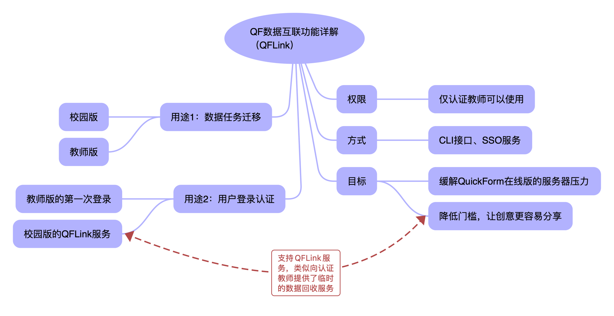
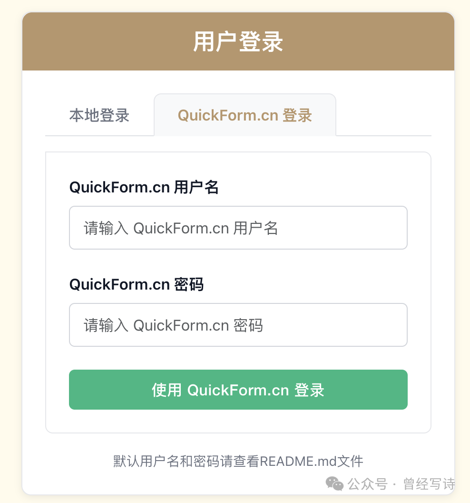
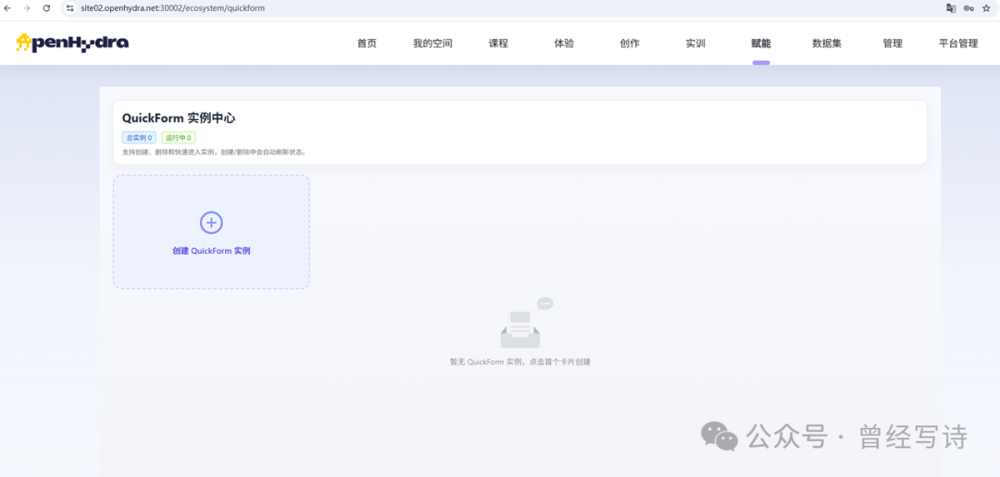
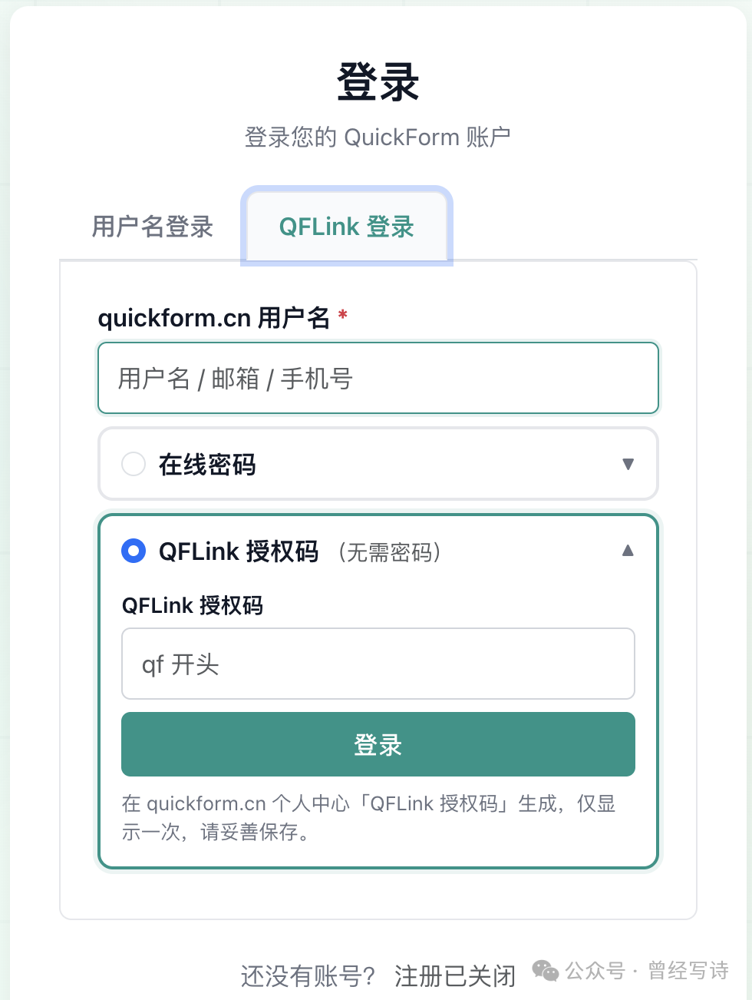
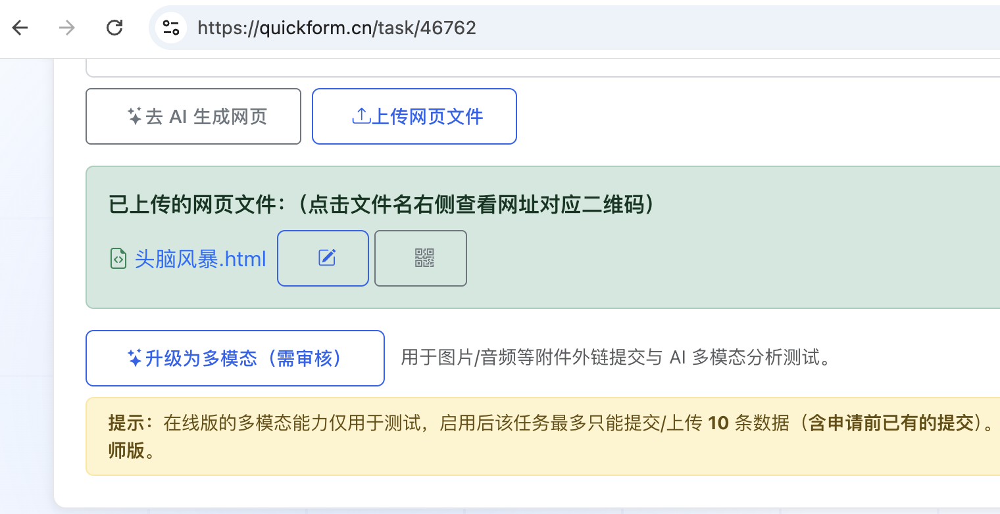
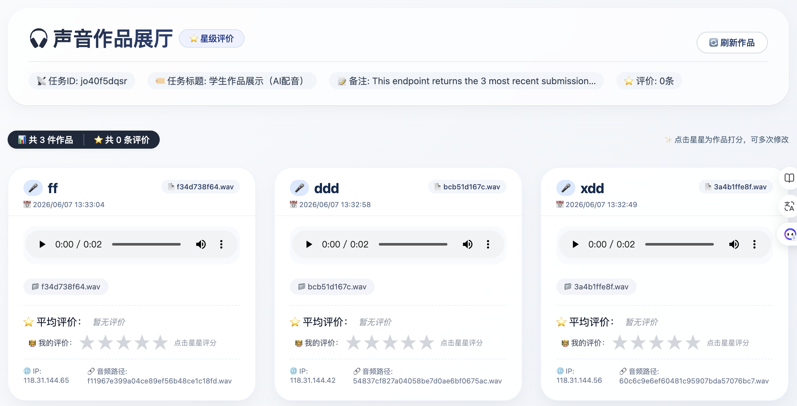
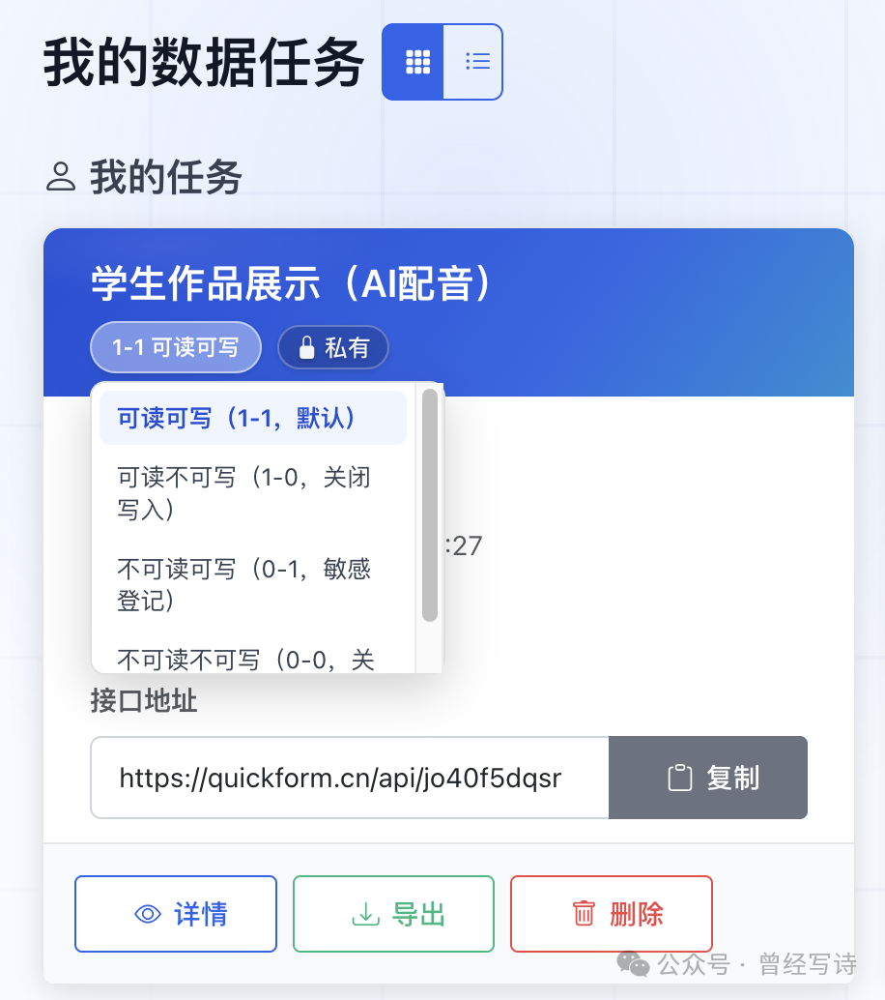

# 提升：QFLink和多模态数据回收

随着QuickForm用户的增加，项目组收到的需求也越来越多，同时在线版的服务器压力也越来越大。于是，QuickForm也不断升级，提供了各种高级功能。

## QF数据互联（QFLink）服务

QF数据互联服务简称“QFLink”，用于QuickForm系列版本的数据互联，实现在线版和其他版本之间的联动。其用途主要有两点：用户认证登录和数据任务迁移。新版的校园版（2.0）和教师版（2.5），默认都支持了QFLink。

### 用户认证登录

用途1：教师版第一次登录

自教师版推出安装包、U盘版文件后，在本地部署QuickForm已经越来越容易。常常有老师问一些低级的问题，比如用户名和密码是什么？因为好多老师们不知道要打开“readme.md”文件，获取基本信息。

在教师版安装后第一次登录时，可以选择QFLink方式，用在线版的用户名和密码登录。登录后，默认管理账户就自动转为在线版的用户名，并且能直接使用“任务导入”功能，导入在线版的数据任务。不仅可以导入任务的名称、简介和附件（HTML），还可以自动导入数据。

这个功能特别适合企业提供的QuickForm教师版的收费服务。因为QuickForm在线版没有办法提供稳定可靠的数据回收服务，老师们在上公开课之类重要工作的时候就特别担心。于是，有企业开始提供收费的教师版服务了。其原理是提供一台虚拟机，内置了教师版服务。用户购买服务类似“开机”，几乎没有任何技术门槛。启动后，输入在线版的用户名和密码，导入数据任务直接使用了。数据回收工作完成后（比如公开课结束），导出或者备份数据，关闭服务，就完成了所有工作。

急需稳定的数据回收服务，又没有能力部署服务器的老师，可以访问OpenHydra网站购买一个教师版服务，以备不时之需。

OpenHydra网站：[https://openhydra.net](https://openhydra.net)

用途2：校园版的“临时”服务

当校园版的管理员开启了QFLink用户登录服务，在线版的用户都可以临时“借用地盘”使用数据回收服务。其使用方法和教师版完全一致，即选择“QFLink登录”，再“导入任务”，完成后导出任务。

目前，温科高的校园版已经支持QFLink服务。很快的，中鸣人工智能教学平台，浙江省的官方AI教学平台都会相继推出支持QFLink服务的校园版QuickForm。敬请期待。

### 数据任务迁移

顾名思义，数据任务迁移是指把QuickForm的数据任务从某个版本迁移到另一个版本。自教师版2.0和校园版1.0开始，就提供了数据任务到导入和导出功能。而“数据任务迁移”则支持在线操作，更加便捷。

功能1：数据任务和系统分离

在QuickForm的理念中，数据任务是灵活的、独立的，类似一个Word、PPT文件，并没有“绑定”在某台服务器或者某个系统上。这样一来，即使在线版流量不足，即使网络服务出现问题，也可以随时转到其他服务器上使用。

功能2：智能替换API地址

数据任务和系统分离看起来很好，但实现起来并不容易。最大的困难在于API地址的变化。普通教师毕竟没有能力直接修改HTML的源码。为此，新版QuickForm都增加了“智能替换API地址”功能。当用户从在线版导入任务时，会自动将网页中的API地址更换为相对路径（可以不用理解这个名词）。这样一来，只要学生是通过教师版的服务器地址（扫码）访问的网页，不管IP地址怎么变换，都能正常提交数据，正常看大屏。再也不用担心老师们问，为什么在线版本正常，教师版用不了。只要你先把在线版的任务调试成功。

再次强调一下数据任务的最佳路径：基于在线版制作、调试 -> 教师版或者校园版导入使用。

## 多模态数据回收

模态（Modality），在这里指的是数据存在的形式或类型，如文本、图像、音频、视频、传感器数据等。多模态数据（Multimodal Data）是指由两种或两种以上不同模态的数据组合而成的数据集合。QuickForm一开始仅仅支持文本类数据，支持多模态数据回收，指的是其能够支持文件上传了。

教师版默认支持多模态数据，上传后的文件存储在“/static/upload/”中以APIID命名的文件夹中。在线版目前需要申请试用。支持多模态数据后，可以回收学生的手写、手绘的作品了。

多模态数据任务的数据格式完全兼容普通任务。点击任务的“数据分析”，就可以看到数据格式。多模态任务比常规任务仅仅多了一个字段“attachment”，其内容为多模态文件的URL（相对路径）。

> {"fullName": "谢作如", "schoolName": "温州科技高中", "subjectStage": "高中信息科技", "qfUsername": "xiezouru", "problemDescription": "收集实验照片", "applyTimestamp": "2026-06-02T07:00:56.394Z", "attachment": "/static/uploads/ktvkvyucxj/650be1d704.pdf"}

## 高级数据任务类型

QuickForm一直不提倡用来回收敏感数据。因为最初的设计是可读可写，使用同一个API。虽然方便，却很容易造成数据泄漏。为满足用户设计各种问卷形式的数据任务的需求，QuickForm在线版升级了数据任务的类型，模仿操作系统中的文件读写权限，将数据任务分为四类：

- 可读可写（1-1）。默认状态。
- 可读不可写（1-0）。适用于写入结束，但需要演示的任务。
- 不可读可写（0-1）。适用于敏感数据，如问卷、后台注册等。
- 不可读不可写（0-0）。任务关闭。

只要看到数据任务列表中和卡片上有“1-1可读可写”的文字，点击就会出现下拉菜单，然后可以切换状态。

### CLI接口

QuickForm CLI 接口供命令行、扣子编程、OpenClaw 等工具使用。适合高级用户，实现自动化创建与查看数据任务工作。

CLI接口说明：[https://quickform.cn/cli](https://quickform.cn/cli)

