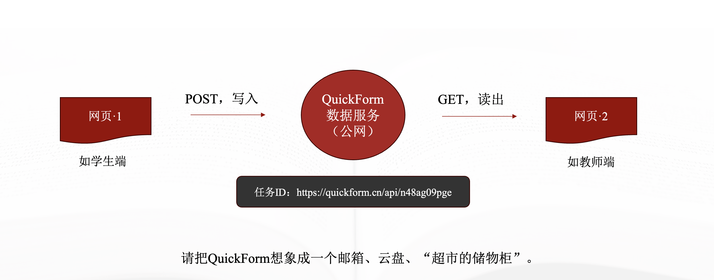
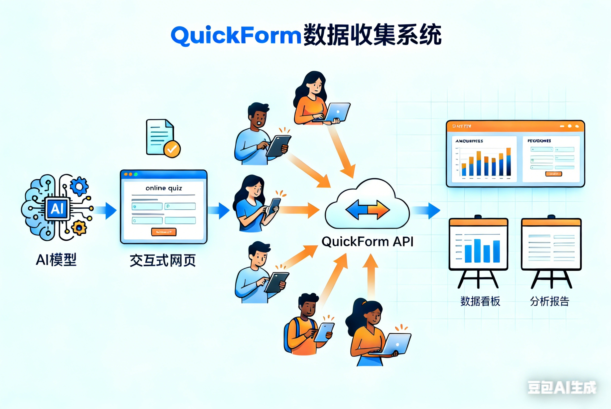

# 原理：QuickForm的工作流程

在第一次接触交互网页制作的老师眼里，QuickForm是一个神奇的网站。只要一句话，大模型生成的网页嵌入了QuickForm的数据地址，数据就很神奇的汇聚在指定的地方。实际上，回收数据本来就是网页的交互功能之一，属于最基本的能力。

## QuickForm的工作原理

任何网页要实现数据传递，一般都通过表单（From）技术。顾名思义，表单就是网页上的表格。注册用户、登录网站等操作，都要先在表单上填写一些信息。那些文本框、单选框、多选框、下拉菜单等，都属于表单中的各种控件。每个表单都有一个“action”属性，表示表单要提交的地址。这个地址可以是网页自身，也可以是其他网页。

QuickForm的原理是提供了一个写入和读出的数据接口（WebAPI），然后将任何提交过来的数据分类保存在数据库中。因为每一个数据任务的地址都是不同的，有独特的标识（即APIID），所以不会混淆。其工作流程如下：

因此，我们可以把Quickform提供的WebAPI地址看成是一个云盘（U盘），可以随时写入数据，也可以读出。只要我们对大模型说：“……请将网页的数据以POST形式提交到……”实际上就告诉大模型，这个网页要用表单技术来提交数据，表单的“action”属性地址就是提供的URL，数据提交方式（method）是POST。因为表单技术很成熟，大模型都能理解，所以基本上所有大模型都能正确生成网页。

需要强调的是，浏览器的数据传输（即前后端交互）经历了好几个阶段。最初使用“Form”，后来使用XMLHttpRequest，现在则基本上使用Fetch API。具体请参考“学习资料”中的“网页开发基础”。

## QuickForm的设计理念

很多人会认为表单的数据要按照一定的规范设计，一开始就要规划好各种字段数量和类型，否则将无法正常保存也难于做后续分析。的确，传统的表单数据是需要精确定义了字段数量和类型，然后借助SQL语言进行分析。

QuickForm的设计理念是“用AI解决AI的问题”，先把所有的数据合并为一个“包”，整体保存，然后再借助大模型将收集到的数据逐一解开进行分析。即使提交到QuickForm的数据缺少规范，看起来是凌乱的，但是在大模型的强大能力支持下，依然可以做分析统计。事实证明，QuickForm的设计是可行的。用户不需要了解数据类型之类的专业知识，不用关心数据格式和SQL，只要能描述要求，能正确回收数据，大模型就能协助做好后续的分析工作。

“用AI解决AI的问题”，实际上继承了图灵的思想，就是“用机器打败机器”。因此如果想得到更好的效果，你可以下载数据后，直接和大模型对话，以得到更加精细化、个性化的分析。

## QuickForm的教学应用

QuickForm提供的API不仅可以写入（POST方式），还可以读出（GET方式），因此可以做多种交互网页，如表单提交、实时统计等。而这些都通过同一个API地址就能实现，降低了难度，又不牺牲其灵活性。

- 经典应用：将数据用POST方式提交到QuickForm。如问卷回收，在线考试等。
- 交互分析：用网页1提交数据，再做一个网页2读取数据实时分析。如数据看板、数据驾驶舱、数据大屏等。
- 即时互动：在一个网页上边提交数据，边读取数据。如聊天室、留言本等。
- 组合应用：多个数据任务结合，可以做出复杂的应用来。如用数据任务1（WebAPI）来发布任务，用数据任务2来接收答题情况。

实际上，QuickForm不仅为教师设计，学生也能用来做各种科创作品，甚至可以用来替代MQTT服务器，结合开源硬件设计物联网作品。目前QuickForm已经支持多模态数据回收，即文件上传，还支持可读不可写、可写不可读等复杂的数据任务。

## QuickForm的能力边界

为了实现极致的简单易用，即“极简”，QuickForm牺牲了牺牲了数据的安全性。数据可读可写，API地址在前端页面中的明码可查。因此，你务必要了解其能力边界，做到如下几点：

1.不要用QuickForm记录具备敏感数据。涉及到人名、通讯信息、成绩之类的数据，最好用脱敏的方式来做，如使用班级编号而不是学生名字。

2.不要用QuickForm长期存储某一类数据。QuickForm参考微信小程序上的“即用即开，用完即走”的理念，一个数据任务有特定周期，结束后就关闭，有用的数据导出。

3.不要用QuickForm存储大量数据。QuickForm.cn是校园版的演示网站，不宜用来记录和读取太多的数据，否则会给服务器带来太多压力。强烈建议使用本地的教师版。

如果你因为误用QuickForm而造成数据泄密，我们不承担责任。具体请参考“免责声明”。

## 浏览器推荐

在任何编程语言中，网页语言（HTML）的兼容性是做得最好的。因此用网页（HTML）来编写教学课件是未来的方向。考虑到兼容性，我们极力推荐使用谷歌浏览器。

