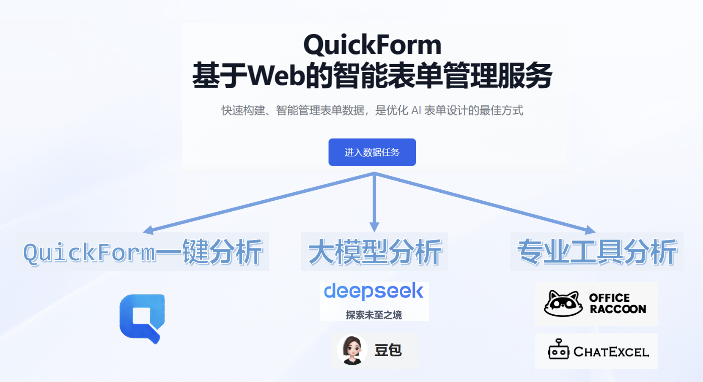
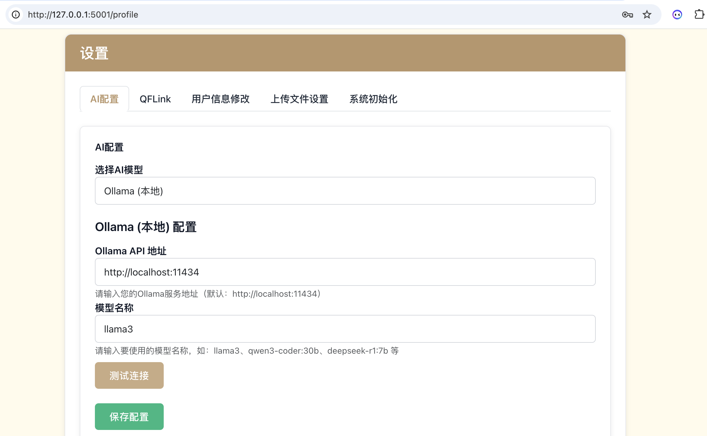

# 进阶：数据分析和大屏显示

当你用QuickForm收集了相关的数据后，下一步就是分析数据。虽然在QuickForm的“任务详情”中能看到所有回收数据，但毕竟不够直观。


## 数据分析的多种方法

QuickForm提供了多种数据分析的方法。如导出数据后，用大模型和专业工具分析，或者使用QuickForm内置一键分析等。



### 1.导出数据，借助工具分析

方式1：大模型分析。

无论是导出csv或者json格式，大模型都能分析。最好同时上传回收数据的网页问文件，让大模型能够充分理解这些数据的意义，即数字分别代表什么。

参考提示词：

> 借助附件中的网页文件，我收到了相关数据（见csv文件），请根据这些数据写一份分析报告。


方式2：专业工具分析

如果数据比价复杂，大模型可能分析不够准确。推荐使用专业的数据分析工具，如腾讯的WorkBuddy、商汤办公小浣熊等。

### 2.QuickForm内置一键分析

QuickForm内置了“一键分析”功能，点击即可生成报告。要使用这个功能，需要先配置大模型厂商的APIKEY。

### 3.数据大屏形式分析

除了这些以外，最能打动老师的是实时大屏分析。很多老师因为看到炫酷的数据大屏效果，而被大模型+QuickForm的能力深深打动。实际上Quickform测试版发布不久后，就能支持数据双向流动的能力，具备了编写数据大屏的技术基础。

## 数据大屏的实现

数据大屏也称“数据看板”（dashboard）。在企业数字化场景中，通常指通过可视化方式将关键业务指标、数据趋势、运营状况等信息集成展示于单一界面的大屏系统。课堂教学中，使用数据大屏可以实时了解学生的学习情况，一目了然，的确很受欢迎。

顺便说一下，关于数据大屏的需求是平阳的谢贤晓老师最早提出。下面是她在听一节课公开课时拍的照片。


山东德州的高老师（立羽老师）做了一个很清晰的教程，值得初学者参考使用。但需要注意的是，大模型的能力变化很大，完全按照视频可能会不成功。

<iframe src="//player.bilibili.com/player.html?isOutside=true&aid=116352912327762&bvid=BV1pYSXBLEXy&cid=37268293989&p=1" scrolling="no" border="0" frameborder="no" framespacing="0" allowfullscreen="true"></iframe>

### 从QuickForm原理说起

Quickform支持使用同一个数据任务的API地址进行读写操作，即用POST方式写入数据，GET方式读取数据。我们可以把Quickform看成是一个数据U盘、云盘。


需要说明的是，在数据读写方面校园版和教师版略有不同。对于教师版来说，直接在浏览器上访问数据任务的WebAPI（就是提供的URL地址，https://quickform.cn/api/kpgugxdskx），就能看到所有的数据。但是，校园版（在线版本）只返回最新3条数据，需要增加“/all”，如https://quickform.cn/api/kpgugxdskx/all，这样才能返回所有数据。


### 数据大屏的编写

数据大屏同样是交互网页的一种。跟学生端交互网页开发一样，我们也可以利用提示词借助AI大模型来编写。

按照能不能主动去访问外部网页，我们可以把能编程的大模型分成A、B两类。A类是内置技能，可以自己去访问网址的，比如扣子编程。B类是不具备访问网址能力，如deepseek、豆包（很奇怪，有时候deepseek也是能自己去访问网站的）。面对不同的大模型，要采用不同的提示词。

#### A类大模型：简洁版提示词

A类大模型严格说是编程智能体，如扣子编程、Trae等。面对A类，可以使用简洁版提示词：

> 提示词：我需要做一个数据大屏（数据看板），数据来自：https://quickform.cn/api/kpgugxdskx/all(GET请求可获取所有提交记录)。每隔10秒钟刷新一次。

一般来说，大模型会自动访问“https://quickform.cn/api/kpgugxdskx/all”，然后解析数据格式，设计数据看板。对于提示词，有很多种写法，你也可以这样：

> 提示词：我需要做一个数据大屏（数据看板），数据来自：https://quickform.cn/api/kpgugxdskx/all。每隔10秒钟刷新一次。

或者，这样也行。

> 提示词：我需要做一个类似数据大屏（数据看板）的网页，数据来自：https://quickform.cn/api/kpgugxdskx/all。每隔10秒钟刷新一次。


> 提示词：我需要做一个数据大屏（数据看板），数据来自：https://www.quickform.cn/api/o30myztdie/all(GET请求可获取所有提交记录)。每隔10秒钟刷新一次。


#### B类大模型：完整版提示词

对于deepseek、豆包之类，不能自己去访问网址的，使用“完整版提示词”，如：

> 提示词：我需要做一个数据大屏（数据看板），数据来自：https://www.quickform.cn/api/o30myztdie/all(GET请求可获取所有提交记录)。每隔10秒钟刷新一次。数据格式如下：
> {
>   "note": "Total 1 submission(s).",
>   "submissions": [
>     {
>       "submitted_at": "2026-04-04 14:44:18",
>       "关键词数量": 5,
>       "提交时间": "2026/4/4 14:44:17",
>       "查看任务一": true,
>       "查看任务二": true,
>       "环境因子数量": 6,
>       "组名": "第3组",
>       "自定义创意": "无",
>       "选中创意": "🐝 自动授粉系统",
>       "闯关得分": "3/6"
>     }
>   ],
>   "task_id": "o30myztdie",
>   "task_title": "《智能种植初探秘》活动1",
>   "total_submissions": 1
> }


数据格式来自哪里？用浏览器打开“https://www.quickform.cn/api/o30myztdie/all”，然后复制出来即可。或者另存为txt文件，上传给大模型也行。在新版本（2026年4月30日更新）中，QuickForm在“数据分析”中提供了“数据大屏”的推荐提示词，成功率很高。


#### 三个关键技巧

实际上，老师们编写数据大屏也常常会遇到问题。但只要记住三个关键即可：

1.打开“深度思考”

最好打开大模型的“深度思考”功能，让大模型有足够的时间分析数据格式，写出准确的代码。

2.提供数据样例。

如果大模型反馈无法读取api地址之类（看“思考”输出的内容），这时候生成的代码肯定不能用，大概率是模拟的。你就提供访问API地址，如“https://quickform.cn/api/kpgugxdskx/all”。将里面的文本复制出来给大模型看，也就是使用完整版的提示词。你可以重新提问，也可以追问：

> “https://quickform.cn/api/kpgugxdskx/all”的数据格式如下……
> 继续修改。

你也可以保存为txt文件，作为附件补充。因为网页提交的数据和获得的数据格式并不一样，大模型无法脑补数据长什么样子。你如果不提供，能力再大的大模型也做不到。

**这个方法同样适用于本地部署的教师版，即给出网址的同时，提供样例数据。**

3.提供数据说明。

有些交互网页提交的数据很抽象，只有数字，或者ABCD之类的字母，不知道表示什么意思。如果想做出来的数据大屏有意义，必须要说明这些数据代表什么。简单的办法是，将交互网页作为附件发给大模型，或者在制作交互网页的对话中继续提需求。参考提示词如下：

> 我做了一个交互网页（student.html），收集了相关的数据。通过访问地址“https://192.168.31.53/api/kpgugxdskx”就能获取全部数据，数据的格式如下……。请设计一个数据大屏，每隔10秒钟刷新一次。

附：QuickForm的数据格式详解

QuickForm的数据格式非常简单，以JSON（JavaScript Object Notation，一种轻量级的数据交换格式）作为交换格式。返回一个对象，有“note”、“submissions”、“task_id”、“task_title”、“total_submissions”等5个字段。其中“submissions”的值为数组，数组内单条记录的值为对象，每一个对象，就是每一次提交收集的数据包。

```json

{
  "note": "提示",
  "submissions": [
    {记录1},
    {记录2}
  ],
  "task_id": "任务的API值",
  "task_title": "任务名称",
  "total_submissions": 记录数量，如2
}

```

以下面一个科学调查的数据任务为例。

```json

{
  "note": "This endpoint returns the 3 most recent submissions. Full list: https://quickform.cn/api/sg826h31vv/all",
  "submissions": [
    {
      "age": 49,
      "consent": "同意",
      "gender": "女",
      "health_status": "健康，无不适",
      "measurement_date": "2026-04-06",
      "measurement_site": "口腔",
      "measurement_site_raw": "口腔",
      "measurement_time": "11:08",
      "pre_activities": [
        "无"
      ],
      "resting_confirmation": "是",
      "submitted_at": "2026-04-06 11:09:01",
      "temperature_celsius": 37.4
    },
    {
      "age": 51,
      "consent": "同意",
      "gender": "男",
      "health_status": "健康，无不适",
      "measurement_date": "2026-04-02",
      "measurement_site": "腋下",
      "measurement_site_raw": "腋下",
      "measurement_time": "22:46",
      "pre_activities": [
        "无"
      ],
      "resting_confirmation": "是",
      "submitted_at": "2026-04-02 22:50:21",
      "temperature_celsius": 36.4
    }
  ],
  "task_id": "sg826h31vv",
  "task_title": "科学调查（体温）",
  "total_submissions": 2
}

```

**注意事项：在线版和教师版的获取数据API有细微区别**

在线版和校园版都需要加上“/all”才能看到所有数据，否则仅仅返回3条。但是，教师版不管是否加“/all”都返回全部数据。这样的设计是为了省流量。我们担心老师们对API不熟悉，给大模型写指令的时候，万一忘了提醒“每隔多少时间刷新一次”，就是造成服务器不断刷新。不仅服务器性能受影响，也会浪费流量。所以直接在浏览器上访问数据任务的WebAPI，校园版返回的是最新3条数据。

### 数据大屏的问题排查

如果遇到各种问题，也不用担心，肯定能找到解决方案。

1.可能是js文件没有正常加载。因为大模型生成的数据大屏页面，需要js代码的支持，这些js代码的地址往往在国外网站。我们多次发现电信的网站不能访问的概率最大。可以请大模型使用国内的地址，提示词如“请使用国内的js文件地址”。

2.可能是大模型的理解错误。我们发现deepseek特别会“胡思乱想”，“API地址”最好不要说成“服务器”，不然容易出错。

3.可能是QuickForm的流量限制。因为频繁读取会极大影响服务器的性能，QuickForm在线版限制了一定时间内的读写频率。请记着写上“每隔10秒钟刷新一次”。在数据任务详情处可以看到具体的接口访问统计。


## 为QuickForm配置大模型APIKEY

QuickForm本身没有内置大模型能力，需要接入大模型才能对数据进行分析。要使用数据分析功能，先要申请一个大模型的APIKEY，即API密钥。

### 认识大模型API密钥

API（Application Programming Interface，应用程序编程接口）是一种允许开发者将特定功能或数据集成到自己应用程序中的工具。借助大模型服务商提供的API服务，即可在自己的代码中远程调用大模型的能力，实现特定的功能。 

API密钥（API key）是一种唯一标识符，是用来访问和调用API服务的凭证。API密钥用于验证请求者的身份，确保只有授权用户才能使用服务。这个密钥由API服务提供商发放，用户在注册并验证身份后，一般通过平台的用户界面获取。通过API，开发者可以发送HTTP请求到指定的URL，并附上必要的参数和API密钥，来获取所需的服务或数据。 

大语言模型API允许开发者将大型语言模型集成到自己的应用程序中，通过发送HTTP请求到指定的URL，并附上必要的参数和API密钥，来获取模型的预测结果。

**注意，如果密钥被泄露，可能导致开销增加或服务滥用。**因此，我们应该确保自己的API密钥安全存储。但是也不用过于担心，引入API密钥能有效帮助我们减少财产损失。一旦API密钥遭到泄露，只要及时把账号内原来的API密钥删除，再创建新的API密钥，无需重新注册账号，就可以保全账户余额的安全。

### 大模型API密钥的获取

QuickForm支持多种大语言模型服务提供商，有硅基流动、deepseek、豆包和阿里云百炼等。对于其他模型，我们将陆续接入。

要获取大模型API密钥，一般要先注册，缴费，然后根据提示一步一步操作，然后获取API密钥。

每个服务商需要分别注册和获取相应的密钥，密钥获取的注册网址和key的获取方式如下表所示（右拉可查看如何获取key）：
<table class="docutils align-default">
    <thead>
        <tr class="row-odd">
            <th class="head">名称</th>
            <th class="head">注册网址</th>
            <th class="head">如何获取key</th>
            <th class="head">tokens赠送情况</th>
        </tr>
    </thead>
    <tbody>
        <tr class="row-even">
            <td>硅基流动</td>
            <td><a href="https://www.siliconflow.cn/">https://www.siliconflow.cn/</a></td>
            <td>登陆后即可看到“API 密钥”</td>
            <td>提供大量免费模型</td>
        </tr>
    </tbody>
    <tbody>
        <tr class="row-even">
            <td>deepseek(深度求索)</td>
            <td><a href="https://platform.deepseek.com/api_keys">https://platform.deepseek.com/api_keys</a></td>
            <td>左侧API keys-创建API key</td>
            <td>500万tokens（注意要去首页认证领取）</td>
        </tr>
    </tbody>
    <tbody>
        <tr class="row-even">
            <td>阿里云百炼</td>
            <td><a href="https://dashscope.console.aliyun.com/apiKey">https://dashscope.console.aliyun.com/apiKey</a></td>
            <td>API-KEY管理-创建新的API-KEY Key</td>
            <td>无</td>
        </tr>
    </tbody>
    <tbody>
        <tr class="row-even">
            <td>豆包（火山引擎)</td>
            <td><a href="https://console.volcengine.com/home">https://console.volcengine.com/home</a></td>
            <td>在“火山方舟”中选“API Key 管理“</td>
            <td>50万tokens</td>
        </tr>
    </tbody>
    <tbody>
        <tr class="row-even">
            <td>moonshot(月之暗面)</td>
            <td><a href="https://platform.moonshot.cn/console/api-keys">https://platform.moonshot.cn/console/api-keys</a></td>
            <td>左侧API Key管理-新建</td>
            <td>15.00 元（认证后领取）</td>
        </tr>
    </tbody>
    <tbody>
        <tr class="row-even">
            <td>glm(智谱清言)</td>
            <td><a href="https://open.bigmodel.cn/usercenter/apikeys">https://open.bigmodel.cn/usercenter/apikeys</a></td>
            <td>左侧API keys-创建API key</td>
            <td>2500万tokens（有效期1个月）</td>
        </tr>
    </tbody>
    <tbody>
        <tr class="row-even">
            <td>ernie(文心一言)</td>
            <td><a href="https://console.bce.baidu.com/qianfan/ais/console/applicationConsole/application">https://console.bce.baidu.com/qianfan/ais/console/applicationConsole/application</a></td>
            <td>左侧应用接入-创建应用（不能重名）-同时需要API Key与Secret Key</td>
            <td>无（注意要实名认证开启服务，可在个人中心确认）</td>
        </tr>
    </tbody>
    <tbody>
        <tr class="row-even">
            <td>openrouter（AI模型聚合平台）</td>
            <td><a href="https://openrouter.ai/settings/keys">https://openrouter.ai/settings/keys</a></td>
            <td>右上角个人头像-Keys-Create Key</td>
            <td>无</td>
        </tr>
    </tbody>
</table>


**注:** 当前多家服务商提供了免费的模型token额度，或提供价格低廉的token购买方案（大约1元能购买1百万字的文字对话权限），用于基本教学已经足够。具体费用请参见个平台说明，同一平台的不同模型资费也有差异，请注意正确配置。

### 本地大模型的接入

QuickForm教师版2.0开始支持本地大模型。只要你的电脑性能还可以，那就试试安装Ollama，用本地算力运行参数量较小的模型。



